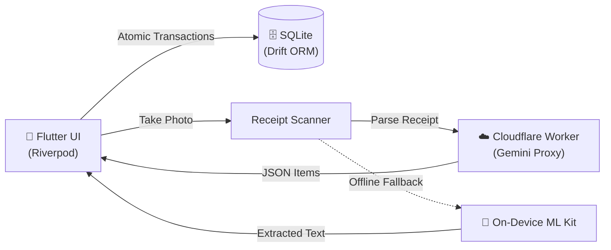

<div align="center">

  

  # ISSA — Sales & Inventory Tracker

  **A fast, offline-first mobile sales and inventory tracker with FIFO batch cost accounting and AI receipt scanning.**

  [](https://flutter.dev)
  [](https://dart.dev)
  [](https://drift.simonbinder.eu/)
  [](https://ai.google.dev/)
  [](https://www.android.com/)
  [](LICENSE)

</div>

---

## 📖 Overview

**ISSA** is an offline-first sales and inventory manager built for small retail and reselling businesses. 

Unlike standard POS apps that maintain a single flat cost price (which corrupts historical profits whenever supplier prices change), ISSA tracks inventory by **batches using FIFO (First-In, First-Out)** accounting. It also includes an **AI receipt digitizer** to quickly turn supplier receipts into inventory stock while keeping all business data strictly private and stored on-device.

---

## ✨ Key Features

- **📦 FIFO Batch Inventory:** Tracks multiple restocking lots per item. Sales automatically consume the oldest stock first, preserving accurate profit margins over time.
- **🤖 AI Receipt Scanner:** Parses paper restock receipts using **Google Gemini 1.5 Flash Vision** (via Cloudflare Worker proxy) with on-device **ML Kit** fallback.
- **🛡️ Human Double-Check:** Staged review screen ensures scanned receipt lines can be edited before touching the local database.
- **⚡ 100% Offline & Local:** Powered by **Drift (SQLite)**. Zero mandatory internet, accounts, or recurring cloud fees.
- **💰 Atomic Sales Transactions:** Single ACID transactions record sold quantities, allocate stock across batches, and record cost snapshots.
- **⚖️ Decimal & Fractional Quantities:** Native support for fractional kilograms (e.g., 0.5 kg steps).
- **📊 Real-Time Financial Dashboard:** Live calculations for Total Capital, Total Revenue, and Net Profit.

---

## 🏗️ Architecture



---

## 💻 Tech Stack

- **Frontend & State:** Flutter, Dart, Riverpod, FL Chart
- **Database:** Drift (SQLite), `sqlite3_flutter_libs`
- **Vision & OCR:** Google Gemini 1.5 Flash Vision, Google ML Kit Text Recognition
- **Backend Proxy:** Cloudflare Workers (`backend/worker.js`)

---

## 🚀 Getting Started

### Prerequisites
- [Flutter SDK](https://docs.flutter.dev/get-started/install) (3.13+)
- Android Studio or VS Code
- Android device or emulator (API 21+)

### Installation

1. **Clone the repository:**
   ```bash
   git clone https://github.com/manalogadiel/ISSA_Sales_Tracker.git
   cd ISSA_Sales_Tracker/issa_app
   ```

2. **Install dependencies & generate database code:**
   ```bash
   flutter pub get
   dart run build_runner build --delete-conflicting-outputs
   ```

3. **Run on Android:**
   ```bash
   flutter run
   ```

---

## ☁️ AI Receipt Proxy (Optional)

To use Gemini Vision for receipt scanning without exposing your Google API key inside the app, deploy the included Cloudflare Worker:

1. Follow the quick setup in [`backend/README.md`](backend/README.md).
2. Enter your Worker URL in the app under **Dashboard** $\rightarrow$ **Settings**.

*(If no proxy is configured, the app automatically falls back to on-device ML Kit OCR).*

---

## 🧪 Testing

Run the automated test suite:
```bash
cd issa_app
flutter test
```

---

## 📄 License

Distributed under the MIT License. See [`LICENSE`](LICENSE) for details.
