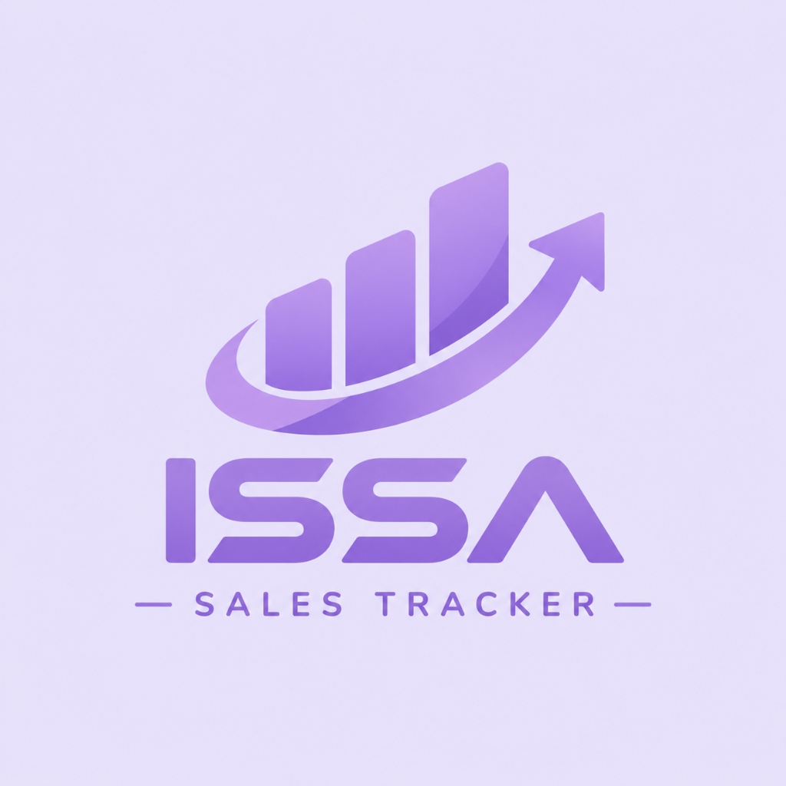
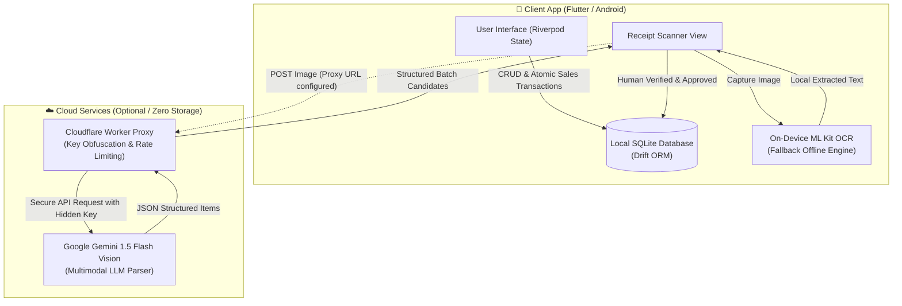
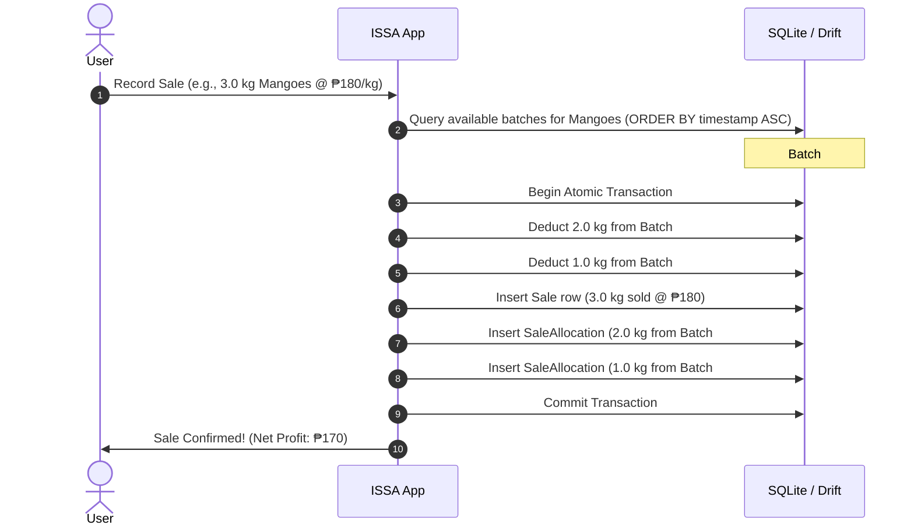

<div align="center">

  

  # ISSA — Sales & Inventory Tracker

  **A modern, offline-first mobile sales tracker featuring FIFO batch cost accounting, real-time profit analytics, and AI-powered receipt scanning.**

  [](https://flutter.dev)
  [](https://dart.dev)
  [](https://drift.simonbinder.eu/)
  [](https://ai.google.dev/)
  [](https://workers.cloudflare.com/)
  [](https://www.android.com/)
  [](https://en.wikipedia.org/wiki/Offline-first)
  [](LICENSE)

  <p align="center">
    <a href="#-key-features">Key Features</a> •
    <a href="#-system-architecture">Architecture</a> •
    <a href="#-data-model--fifo-engine">Data Model</a> •
    <a href="#-tech-stack">Tech Stack</a> •
    <a href="#-getting-started">Getting Started</a> •
    <a href="#-ai-receipt-proxy-setup">AI Receipt Proxy</a> •
    <a href="#-testing">Testing</a>
  </p>

</div>

---

## 📖 Overview

**ISSA** is an offline-first sales and inventory tracker developed specifically for small retail and reselling businesses. 

Most conventional point-of-sale applications either require continuous internet connectivity, charge expensive monthly subscriptions, or oversimplify cost-accounting by maintaining a single flat cost price for products. When supplier prices fluctuate, this naive approach retroactively corrupts historical profit reports.

ISSA solves this with a **FIFO (First-In, First-Out) lot/batch tracking engine**, an **atomic local SQLite database**, and an **AI-driven receipt digitizer** that converts restock paper receipts into structured inventory entries while preserving complete user privacy.

---

## ✨ Key Features

| Feature | Description |
| :--- | :--- |
| 📦 **Batch & Lot Inventory (FIFO)** | Multi-batch capital tracking per product. Sales consume the oldest stock first, preserving point-in-time cost prices and historical margin accuracy. |
| 🤖 **AI Receipt Scanner** | Digitizes paper restock receipts using **Google Gemini 1.5 Flash Vision** (via a secure Cloudflare Worker proxy) and on-device **Google ML Kit OCR**. |
| 🛡️ **Mandatory "Double-Check" UX** | AI output populates an editable staging screen. No data touches the database until confirmed by the user. |
| ⚡ **100% Offline-First Architecture** | Powered by **Drift** (SQLite). All records live securely on-device with zero required cloud logins, external databases, or tracking. |
| 💰 **Atomic Transactions** | Every sale decrements batch allocations and records revenue/profit snapshots within a single ACID-compliant database transaction. |
| ⚖️ **Fractional Quantity Support** | Native support for whole and fractional units (e.g., 0.5 kg increments) without awkward unit configuration steps. |
| 📊 **Real-Time Financial Dashboard** | Instant calculation of Total Active Capital, Total Revenue, Realized Profit, and historical margin performance. |
| 🎨 **Accessible Lavender Palette** | Carefully chosen light lavender theme (`#F7F4FC`, `#B79CED`) with high-contrast deep plum text (`#3A2E52`) and large touch targets designed for quick operation. |

---

## 🏗️ System Architecture



---

## 🧠 Data Model & FIFO Engine

When a product is restocked multiple times at different prices, ISSA stores each shipment as an independent `CapitalBatch`. When a sale takes place, inventory is consumed from the earliest available batch first:



---

## 💻 Tech Stack

### Core Technologies
- **Language:** [Dart](https://dart.dev/)
- **Framework:** [Flutter](https://flutter.dev/) (Targeting Android SDK 21+)
- **State Management:** [Flutter Riverpod](https://riverpod.dev/) (`flutter_riverpod: ^2.6.1`)
- **Local Database:** [Drift](https://drift.simonbinder.eu/) (SQLite reactive query layer) + `sqlite3_flutter_libs`
- **Charts & Graphs:** [FL Chart](https://pub.dev/packages/fl_chart) (`fl_chart: ^0.70.0`)
- **Typography:** [Google Fonts](https://pub.dev/packages/google_fonts) (Inter / Roboto)
- **Code Generation:** `build_runner`, `drift_dev`

### AI & Vision Pipeline
- **Cloud AI Vision:** [Google Gemini 1.5 Flash Vision](https://ai.google.dev/) via `@google/genai`
- **Serverless Security Proxy:** [Cloudflare Workers](https://workers.cloudflare.com/) (`backend/worker.js`)
- **Local Fallback OCR:** [Google ML Kit Text Recognition](https://pub.dev/packages/google_mlkit_text_recognition) (`^0.15.0`)

---

## 📁 Project Structure

```text
ISSA_Sales_Tracker/
├── assets/                       # Global repository assets and logo
│   └── app_logo.jpg
├── backend/                      # Cloudflare Worker AI Proxy
│   ├── README.md                 # 2-minute Worker deployment guide
│   └── worker.js                 # Gemini proxy script with CORS and sanitization
├── issa_app/                     # Flutter Client Application
│   ├── android/                  # Native Android configuration
│   ├── assets/                   # App icons and imagery
│   │   ├── icon/
│   │   └── images/
│   ├── lib/
│   │   ├── db/                   # Drift database schema, tables & DAOs
│   │   │   ├── app_database.dart # Database definition & atomic FIFO transactions
│   │   │   ├── inventory_dao.dart
│   │   │   ├── sales_dao.dart
│   │   │   └── tables.dart
│   │   ├── providers/            # Riverpod state providers
│   │   ├── screens/              # Feature screens
│   │   │   ├── app_shell.dart    # Navigation shell
│   │   │   ├── cost_table/       # Reference cost price directory
│   │   │   ├── dashboard/        # Revenue, capital & profit overview
│   │   │   ├── inventory/        # Product inventory & batch management
│   │   │   ├── receipt_scan/     # AI camera & verification screen
│   │   │   └── sell/             # Rapid point-of-sale checkout
│   │   ├── services/             # Gemini AI & ML Kit parsing services
│   │   ├── theme/                # Lavender design system & colors
│   │   └── widgets/              # Shared reusable UI components
│   ├── test/                     # Unit and integration tests
│   │   ├── database_test.dart    # Atomic transaction & FIFO unit tests
│   │   ├── receipt_ai_test.dart  # AI payload and parsing tests
│   │   └── receipt_ocr_test.dart # Local OCR verification tests
│   └── pubspec.yaml              # App configuration and dependencies
└── README.md
```

---

## 🚀 Getting Started

### Prerequisites
- [Flutter SDK](https://docs.flutter.dev/get-started/install) (version 3.13.0 or higher)
- [Android Studio](https://developer.android.com/studio) or VS Code with Flutter extensions
- Android device or emulator running API level 21 or higher

### Installation & Run

1. **Clone the repository:**
   ```bash
   git clone https://github.com/manalogadiel/ISSA_Sales_Tracker.git
   cd ISSA_Sales_Tracker/issa_app
   ```

2. **Install Flutter dependencies:**
   ```bash
   flutter pub get
   ```

3. **Generate Drift Database code:**
   ```bash
   dart run build_runner build --delete-conflicting-outputs
   ```

4. **Run on an Android device or emulator:**
   ```bash
   flutter run
   ```

---

## ☁️ AI Receipt Proxy Setup

To keep Gemini API keys 100% private and out of reverse-engineered APK files, ISSA routes cloud vision requests through a free Cloudflare Worker.

1. Create a free account on [Cloudflare](https://dash.cloudflare.com/).
2. Deploy a new Worker using the provided code in [`backend/worker.js`](backend/worker.js).
3. Set the encrypted secret `GEMINI_API_KEY` in the Cloudflare Worker settings.
4. In the ISSA mobile app, navigate to **Dashboard** $\rightarrow$ **Settings** $\rightarrow$ paste your worker URL (`https://your-worker.workers.dev`).

> For step-by-step instructions, see the [Backend Setup Guide](backend/README.md).

---

## 🧪 Testing

The repository contains automated unit and logic tests verifying FIFO accuracy, database atomicity, and receipt parsing.

Run all tests via:
```bash
cd issa_app
flutter test
```

Key test suites:
- [`database_test.dart`](issa_app/test/database_test.dart) — Verifies FIFO deduction, batch depletion, and profit calculation integrity.
- [`receipt_ai_test.dart`](issa_app/test/receipt_ai_test.dart) — Tests response parsing, JSON sanitization, and fallback triggers.
- [`receipt_ocr_test.dart`](issa_app/test/receipt_ocr_test.dart) — Verifies text extraction heuristics.

---

## 🎨 Design Philosophy

ISSA was created with empathy for real-world business owners who value speed, simplicity, and clarity:
- **Calm Lavender Aesthetic:** Soft `#F7F4FC` backdrop with `#B79CED` accents eliminates eye fatigue during long selling shifts.
- **Strict High-Contrast Typography:** Deep plum text (`#3A2E52`) ensures readable figures in bright outdoor stall environments.
- **Zero Jargon:** Straightforward metrics: *Capital In Stock*, *Total Sold*, and *Net Profit*.

---

## 📄 License

This project is licensed under the MIT License — see the [LICENSE](LICENSE) file for details.
